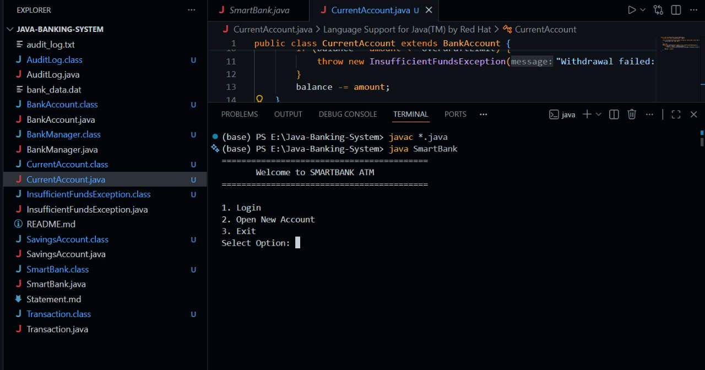
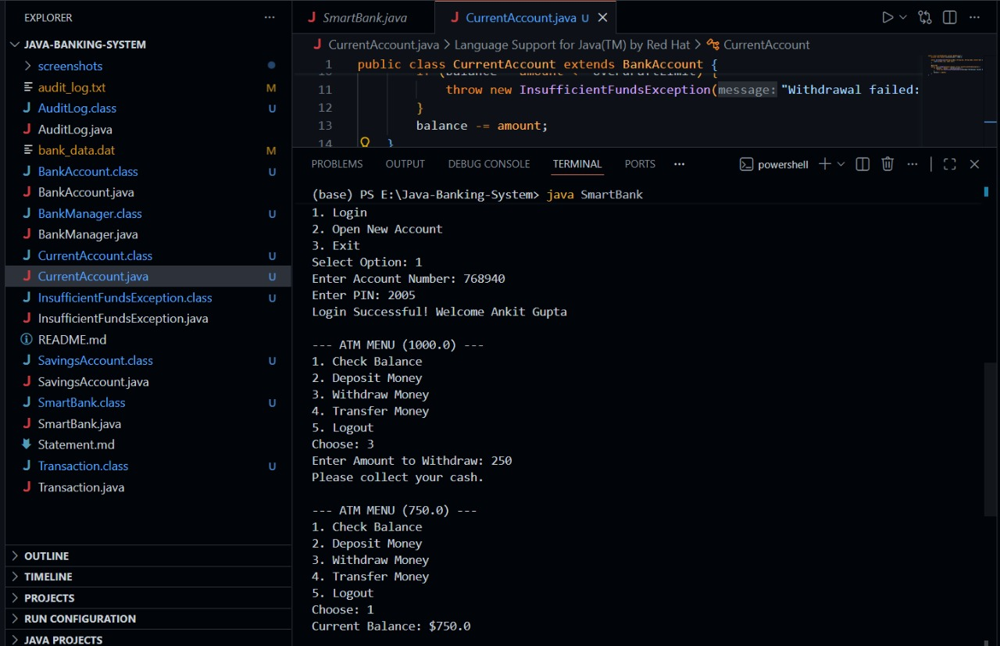
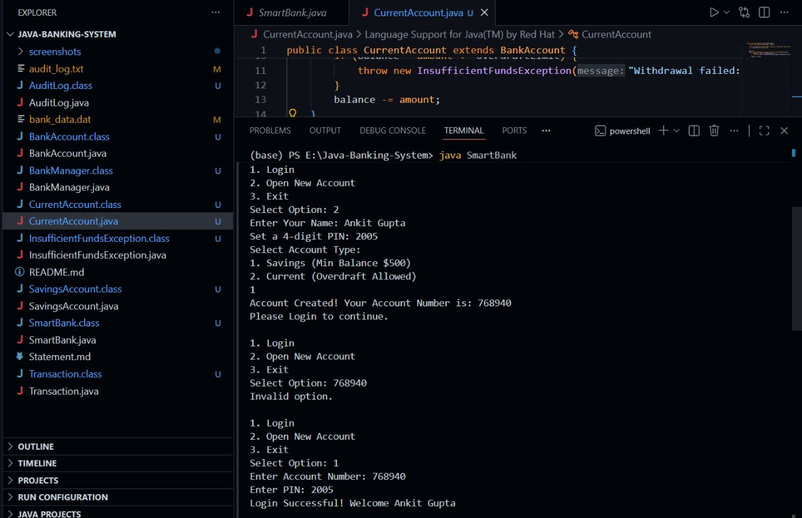

# **SmartBank - Java ATM Interface**

### Overview

SmartBank is a simulation of a banking system that demonstrates advanced Java concepts like Inheritance, Polymorphism, and File I/O. It allows users to create accounts, perform transactions, and automatically logs all activities for security auditing.

### Features

_Multiple Account Types:_   Supports Savings Accounts (Min Balance Enforcement) and Current Accounts (Overdraft Protection).

_Secure Login:_   PIN-based authentication.

_Transaction Engine:_   Deposit, Withdraw, and Transfer funds between accounts.

_Audit Trail:_   Every action is recorded in audit_log.txt with a timestamp.

_Persistence:_   Data is saved to bank_data.dat so you don't lose your money when closing the app.

### Technologies Used

**Language: Java (JDK 14+)**

**_Concepts:_**   Abstract Classes, Custom Exceptions, Object Serialization, File Writing.

**Tools: VS Code, Git.**

How to Run

Compile the Code:

javac *.java

Run the Application:

java SmartBank

Usage Instructions

**Open Account:**   Select Option 2 to create a new account. The system will give you a Random Account Number. Write it down!

**Login:**   Use that Account Number and the PIN you set to log in.

**Transact:**   Try withdrawing more money than you have to test the Exception Handling.

**Check Logs:**   Open the audit_log.txt file in your folder to see the security record.

## Screenshots

Main Menu

Transaction

